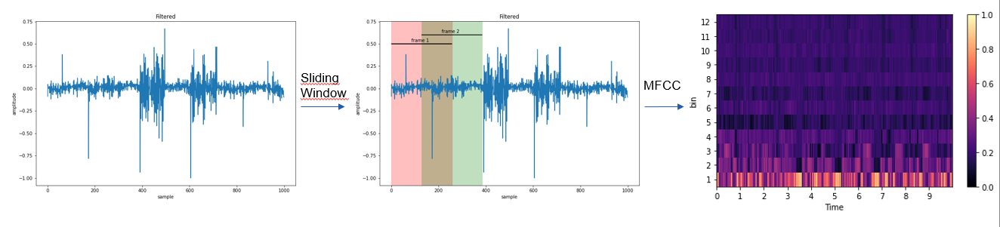
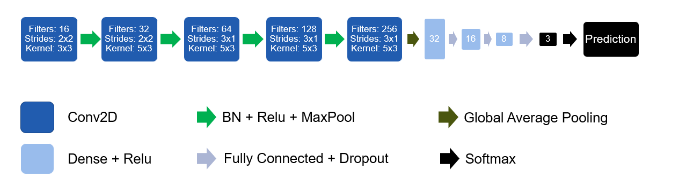

# SLID on a microcontroller

For the ETHZ course of [Machine Learning on Microcontrollers](https://iis-students.ee.ethz.ch/lectures/machine-learning-on-microcontrollers-page/) we had to come up with a project idea that uses a neural network which can run on a STM32 UC with limited resources (64kB RAM, 1 Core running at 80MHz).
We decided to use the onboard microphone and detect spoken languages in real-time.

## Project Overview
### Signal Processing and Feature Extraction
The onboard microphone samples the audio at about 8kHz which was found to be enough,
since human speech is mainly in region of 200Hz-4kHz.
But even at 8kHz the RAM is filled very fast.
Hence, we calculated MFCC features every 256 samples with an overlap of 50%.
12 mel-bins are used, and we aggregated 625 frames before making inference,
which is about 10 seconds of speech.

Since this needs to be done in real-time,
CMSID-DSP was used which can calculate the MFCC features in Q15 very fast. It has a python wrapper
which we used to train the network on the right features already,
because they differ a lot from librosa or pytorch implementations!
The model was trained using keras and converted to a fully quantized int8 network with tensorflow-lite.
This reduced the weight size from 2523 kB to 651 kB while the accuracy only decreased by 0.03%.

### Convolutional Neural Network
We used a simple CNN, because the network weights need to fit on the ram during inference.
The dataset was the [Kaggle SLID](https://www.kaggle.com/datasets/toponowicz/spoken-language-identification)
dataset, where we had several papers as a baseline.

### Model comparison

We wanted to compare our model accuracy with other model types and implementations from other papers.
In the following table one can see different important factors, such as Flash and RAM needed, which is our
main constraint. Luckily our model performed extremely well on the dataset despite its small size while having
an inference time of about 4 seconds.

## Prerequisites
The project was developed on **Windows 10**. You will need [CubeIDE](https://www.st.com/en/development-tools/stm32cubeide.html)
with the [Ai Extension](https://www.st.com/en/embedded-software/x-cube-ai.html).
To easily compile the cmsis-dsp library **Ubuntu** on **WSL2** is used and python and anaconda
is installed on the subsystem instead on Windows. All python scripts are run on WSL!

The platform is an **STM32L475**.
## Installation
- clone the repository

From here run all commands on the Ubuntu subsystem:

- create a new python environment on WSL using e.g. conda `conda create -n slid python=3.8` and activate it `conda activate slid`
- install the requirements `pip install -r requirements.txt`
- download the dataset `kaggle datasets download -d toponowicz/spoken-language-identification`
- extract the dataset and copy the `train` and `test` folder to the folder `audio_processing`
- from the project root folder run `python3 audio_processing/generate_dataset.py` (this takes some time)

Now you will find a folder names as `cmsis_[sample_rate]_[num_mel_bins]_[num_mel_windows]` that contains the converted mel spectograms
as npz files.

## Train the network
In the `model` foder you can find the config file. If you want to track training using WANDB
you can put in your API key there. The `root` entry should be the name of the just created dataset
with the npz files.

Start the training from the project root directory with `python3 models/train.py`

Once the model has been trained it will be saved as h5 file. Quantize the network with
`python3 models/tinify.py`. This will generate a tflite model.

## Deploy
Start CubeIDE with the CUBE-AI plugin and load the project from the `CubeIDE` folder.
If it doesn't work try downloading an older version. Once the upload is done, connect
to the STM via serial and press the onboard button to start recording.

This part is the most complicated as CUBE-AI seems to have its bad days often.
Probably it is better to generate a new project from scratch and convert the settings
and code to your version.